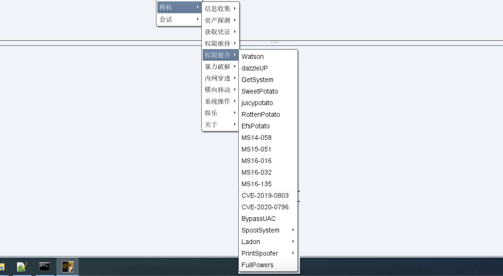
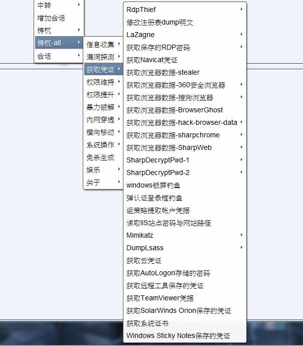
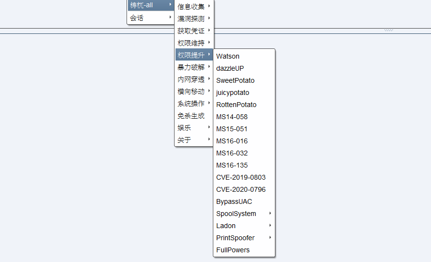
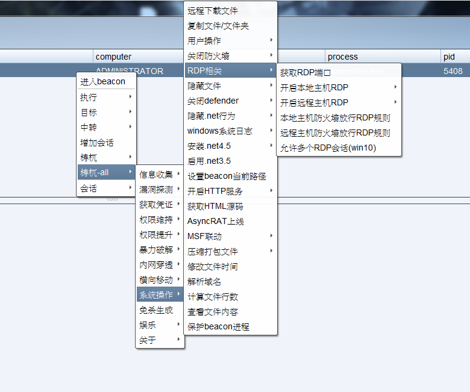

# 梼杌

# 仅供交流与学习使用，请勿用于非法用途！

适用于cobalt strike3.x与cobalt strike4.x的插件

插件里面利用到的exp均为网上搜集，不保证安全问题，请务必自主进行相关安全审查！
# [English-version](https://github.com/pandasec888/taowu-cobalt-strike/tree/english)
感谢[vcarus](https://twitter.com/h4ltorg)提供英文翻译支持

Thanks to [vcarus](https://twitter.com/h4ltorg) for English translation support
# 功能简介
### 公开版

### 完整版

# 贡献者
[vcarus](https://twitter.com/h4ltorg)

[NULLB8](https://github.com/NULLB8)

# 知识星球
分享与交流一线红队知识与技术。星主参与近三十场攻防演练，均为红队。希望借助知识星球社群认识更多的人以及学习更多的知识与技术，与同样热衷网络安全红队技术的人共同进步，提高自身技术水平的同时为网络安全行业贡献绵薄之力。

为了保证星球的质量，星球具有小额收费门槛（介意勿加），也可以投稿原创红队技术文章到邮箱taowuopen@protonmail.com，经审核通过免付费加入。作为回馈，星球内为成员提供梼杌完整版本。（梼杌未来不定期更新完整版本，发布在知识星球-红队空间）

# 参考
https://github.com/DeEpinGh0st/Erebus

https://github.com/timwhitez/Cobalt-Strike-Aggressor-Scripts

https://github.com/0x09AL/RdpThief

https://github.com/uknowsec/sharptoolsaggressor

https://github.com/lengjibo/RedTeamTools/tree/master/windows/Cobalt%20Strike

https://github.com/k8gege/Ladon

如有遗漏，请见谅。
