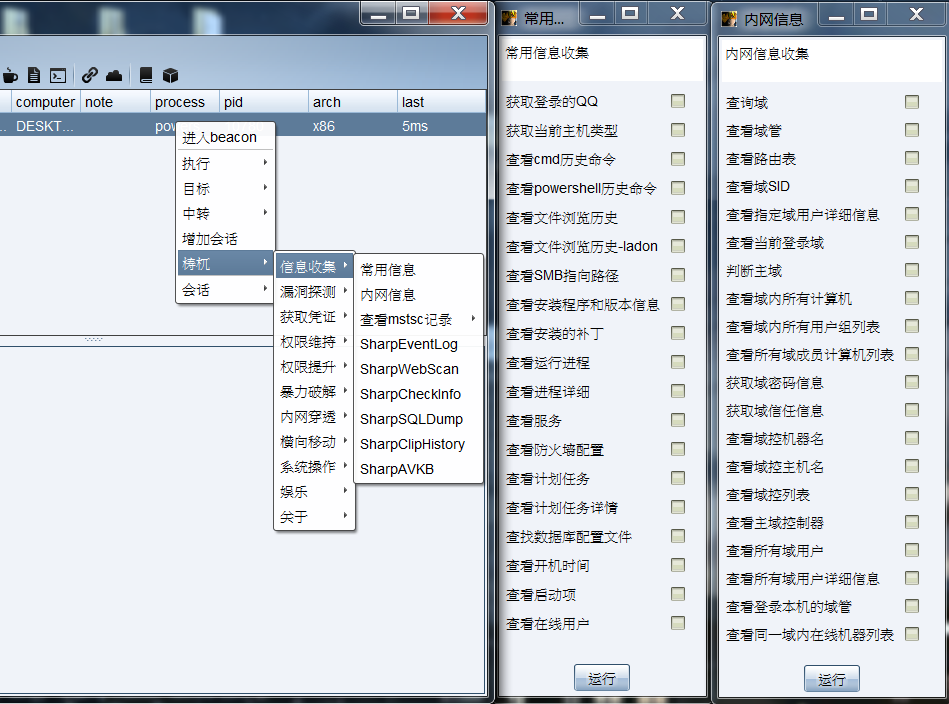
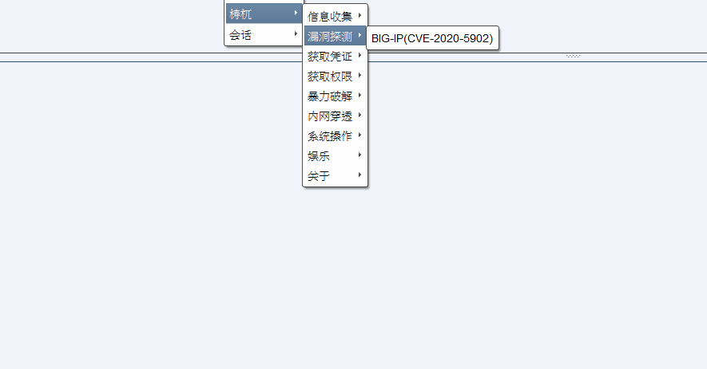
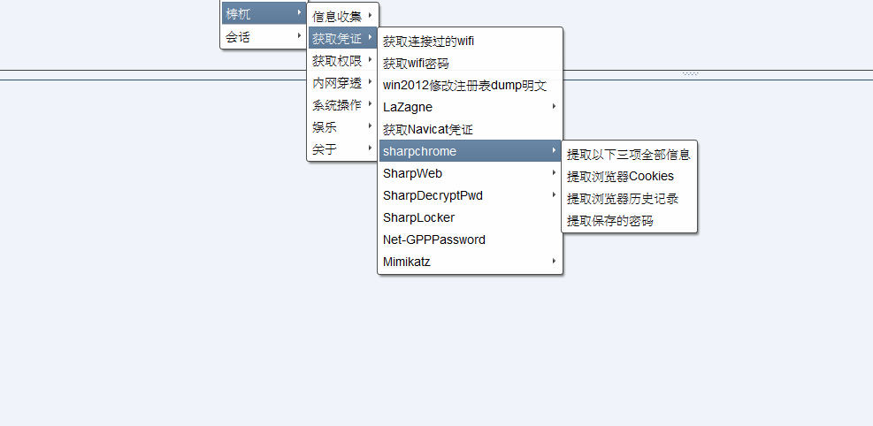
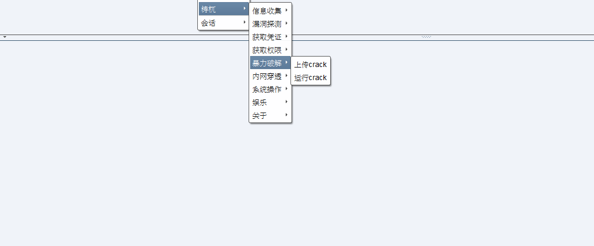
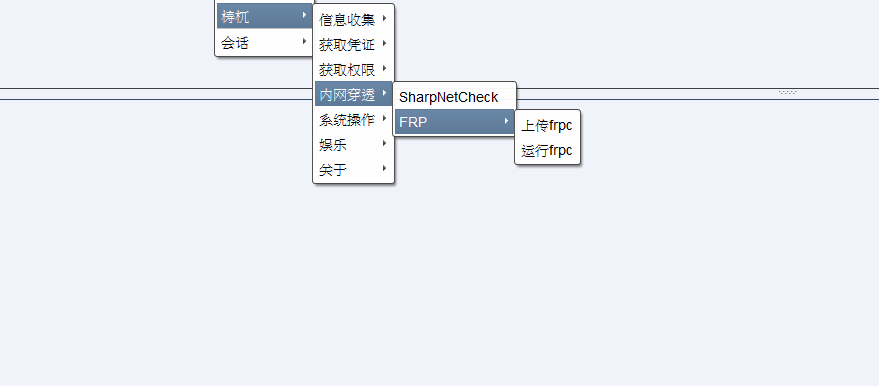
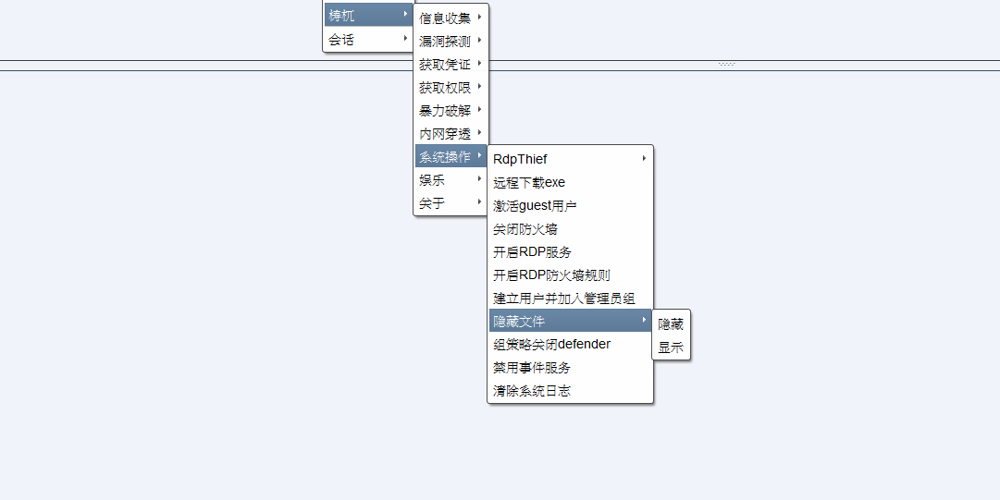
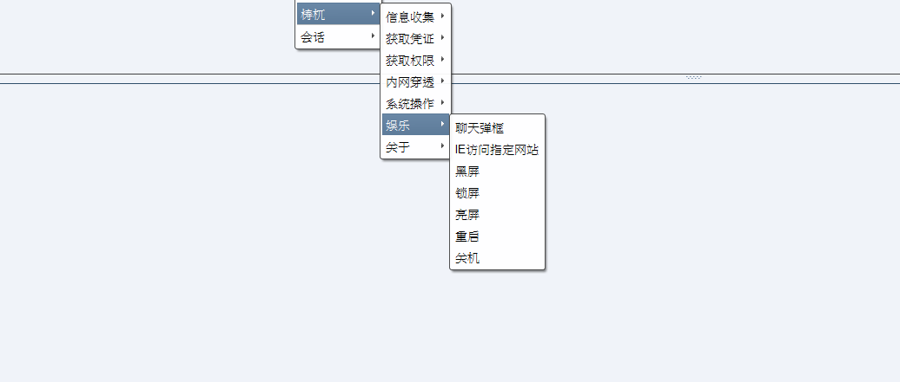

# TaoWu

##TaoWu(檮杌) is a CobaltStrike toolkit.

All the scripts are gathered on the Internet and slightly modified by myself.
You can use it under GPLv3. And all on your own risk.

Any PR is appreciated.
Or you can contact me on E-mail taowuopen@protonmail.com
Let's make TaoWu better than ever together.

Any contributions can grant you TaoWu's internal version access in the near future.

## Note
Base on Cobalt Strike3.x & Cobalt Strike4.x

## Features

## Special thanks
https://github.com/DeEpinGh0st/Erebus

https://github.com/timwhitez/Cobalt-Strike-Aggressor-Scripts

https://github.com/0x09AL/RdpThief

https://github.com/uknowsec/sharptoolsaggressor

https://github.com/lengjibo/RedTeamTools/tree/master/windows/Cobalt%20Strike

## CHANGE LOG
### 3.1 (2020.8.7)
Upload within today

### 3.0 (2020.7.14)
1. Add "Privilege Escalation" "Lateral Movement" function.
2. Add "Port Forwarding" function.
3. Performance improvements.

