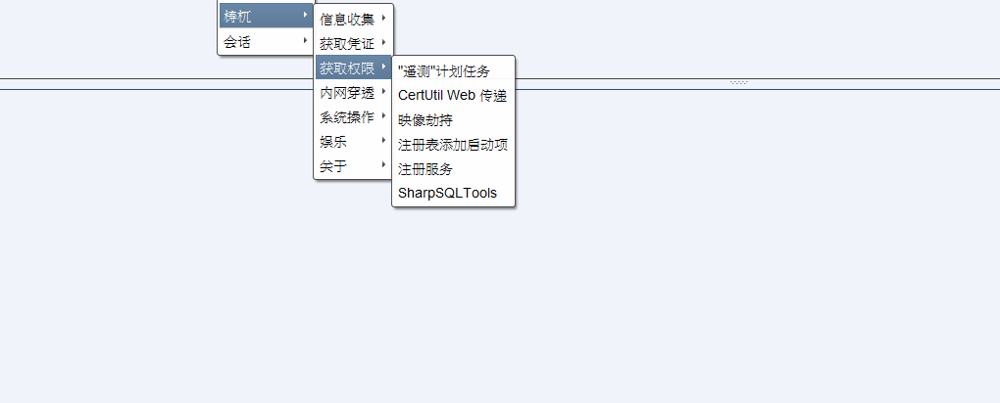
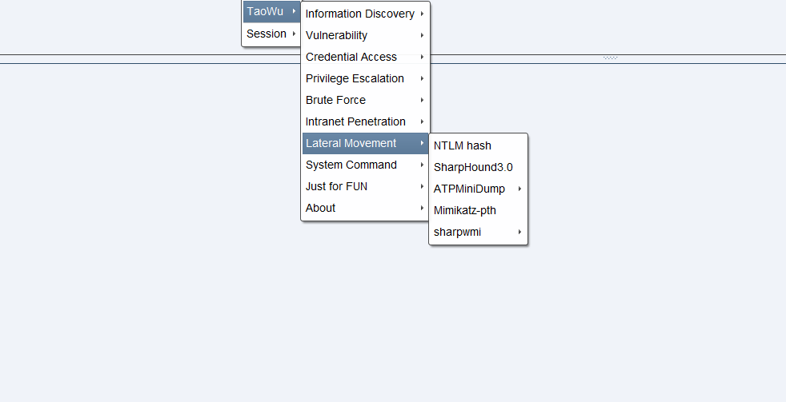

# 梼杌

# 仅供交流与学习使用，请勿用于非法用途！

适用于cobalt strike3.x与cobalt strike4.x的插件

插件里面利用到的exp均为网上搜集，不保证安全问题，请务必自主进行相关安全审查！
# [English-version](https://github.com/pandasec888/taowu-cobalt-strike/tree/english)
感谢[vcarus](https://twitter.com/h4ltorg)提供英文翻译支持

Thanks to [vcarus](https://twitter.com/h4ltorg) for English translation support
# 功能简介

# 贡献者
[vcarus](https://twitter.com/h4ltorg)

[NULLB8](https://github.com/NULLB8)
# 参考
https://github.com/DeEpinGh0st/Erebus

https://github.com/timwhitez/Cobalt-Strike-Aggressor-Scripts

https://github.com/0x09AL/RdpThief

https://github.com/uknowsec/sharptoolsaggressor

https://github.com/lengjibo/RedTeamTools/tree/master/windows/Cobalt%20Strike

如有遗漏，请见谅。
# 更新3.1（2020.7.28）
1.信息收集模块增加杀软对比（对uknowsec师傅的[SharpAVKB](https://github.com/uknowsec/SharpAVKB)稍作修改，与Vulkey_Chen师傅的[avList](https://github.com/gh0stkey/avList)结合，添加了大约400个左右的AV进程检测。

2.漏洞检测模块增加CISCO ASA(CVE-2020-3452)、weblogic（CVE-2016-0638,CVE-2016-3510,CVE-2017-3248,CVE-2017-10271,CVE-2018-2628,CVE-2018-2893,CVE-2019-2725）

3.获取凭证模块增加RcoIl师傅的[SharpDecryptPwd](https://github.com/RcoIl/SharpDecryptPwd)现在共有两个SharpDecryptPwd

4.权限提升模块增加dazzleUP

5.娱乐模块增加录音（扬声器、麦克风）、开启摄像头拍照功能

# 更新3.0（2020.7.14）
1.增加“权限提升”“横向移动”模块

2.优化部分功能的执行方式

3.增加端口转发等功能
# 公告
1.梼杌本身是一个原创加学习结合的项目，一开始就具备了包容的属性，感谢github具有分享精神的大佬开源了这么多优秀的代码，站在巨人的肩膀上总是能看见更大的世界。

2.为了更好的维护该项目，现邀请对此项目感兴趣的所有人共同参与维护开发，项目维护开发不限功能不限技术水平，即使只是输出一个whoami。参与维护的大佬可以直接将代码提交至github或者发送到邮箱taowuopen@protonmail.com。

3.参与维护开发的大佬请在邮件中注明自己的ID与github或是博客地址，以上内容将永久附在github项目页面以及梼杌关于模块一栏。

4.因为各种原因，在项目维护开发中会产生一些不公开的版本，后面会统一为参与维护开发的作者提供梼杌不公开版本。
